# intern_quiz_app

Welcome to `intern_quiz_app`! This Flutter project is designed to create a quiz application with interactive features and visual feedback for correct and incorrect answers.

## Screenshots and Explanations

### Splash, Login and Register Screen

| Splash Page                                     | Login Page                                    | Register Page                                       |
|-------------------------------------------------|-----------------------------------------------|-----------------------------------------------------|
|  | 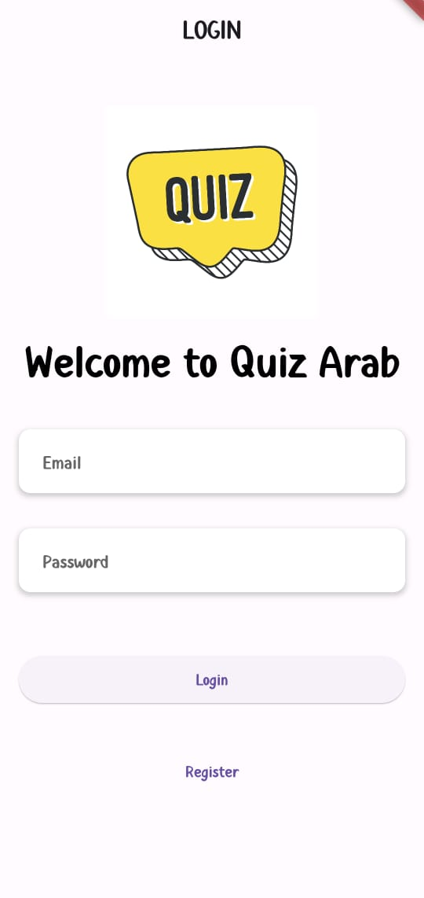 | 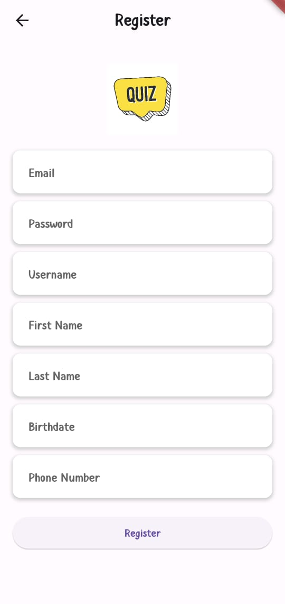 |

- The Login Screen allows users to authenticate with their credentials.
- Includes fields for username and password, with options for social login.
- Provides a link to register if the user is new.
------------------------------------------------------------------------------------------
- The Register Screen enables new users to create an account.
- Fields include email, password, and additional details for registration.
- Includes validation and error handling for input fields.

------------------------------------------------------------------------------------------
------------------------------------------------------------------------------------------

### Home, About and Profile Screen

| Main Page                                        | Profile Page                                      | About Page                                   |
|--------------------------------------------------|---------------------------------------------------|----------------------------------------------|
| 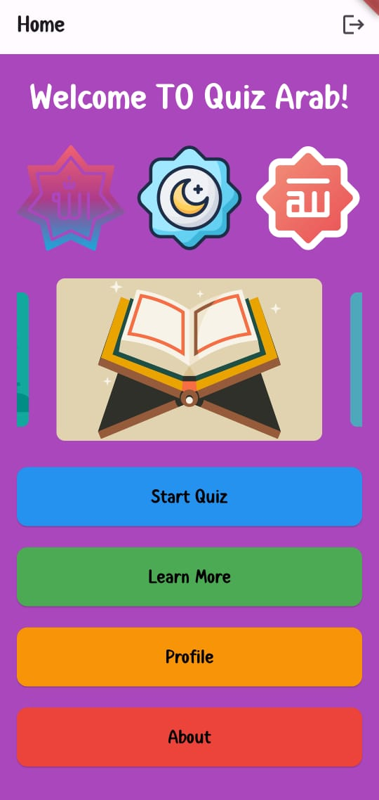      | 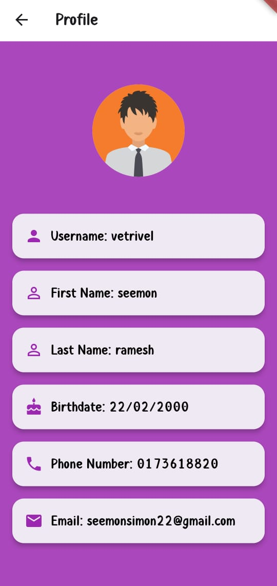 | 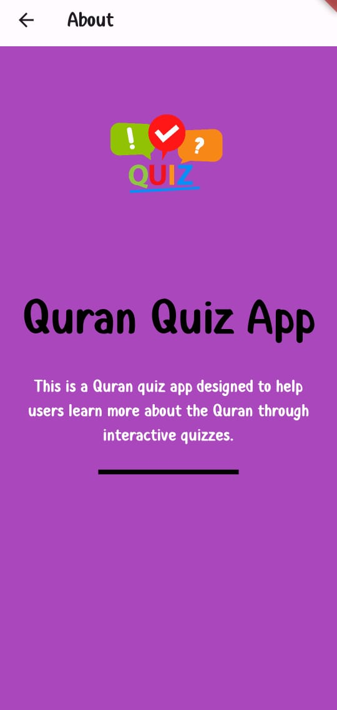 |

- The Home Screen is the initial screen users see upon opening the app.
- It provides options to start the quiz or learn about the quiz app.
- Features include navigation buttons and a clean, user-friendly design.
------------------------------------------------------------------------------------------
- The About Screen offers insights into the purpose and features of the quiz app.
- Includes details about the developer, app version, and acknowledgments.
- Enhances transparency and trust by providing background information.
------------------------------------------------------------------------------------------
- The Profile Screen displays user information and settings.
- Includes options to view and update personal details.
- Enhances personalization and user management within the app.

------------------------------------------------------------------------------------------
------------------------------------------------------------------------------------------

### Quiz Screen

| Quiz Screen                                 | Correct Feedback                                             | Incorrect Feedback                                               |
|---------------------------------------------|--------------------------------------------------------------|------------------------------------------------------------------|
| 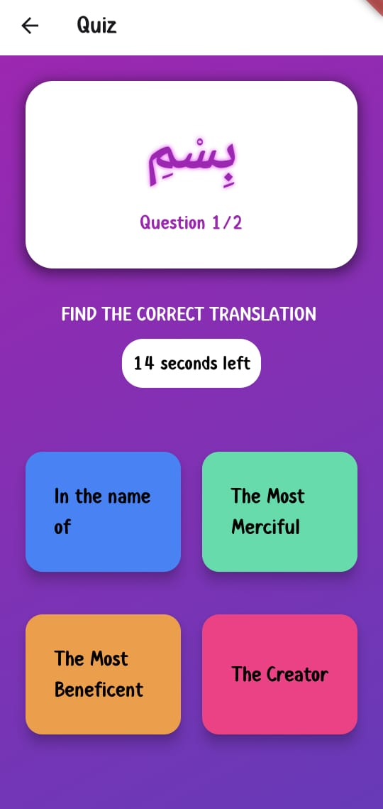 | 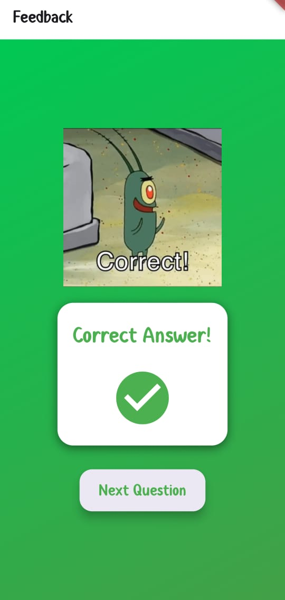 | 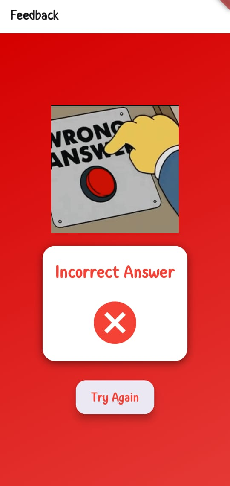 |

- The Quiz Screen presents questions with multiple-choice options.
- Includes a countdown timer, background music, and animated transitions.
- Users select answers and receive immediate feedback through GIFs and messages.
------------------------------------------------------------------------------------------
- The Feedback Screen appears after answering each question.
- Displays a GIF and message based on whether the answer was correct or incorrect.
- Offers an option to proceed to the next question or try again.

------------------------------------------------------------------------------------------
------------------------------------------------------------------------------------------

### Learn More and Marks Screen

| Pdf Selection Screen                                            | Pdf Viewer Screen                                       | Marks Screen                                   |
|-----------------------------------------------------------------|---------------------------------------------------------|------------------------------------------------|
| 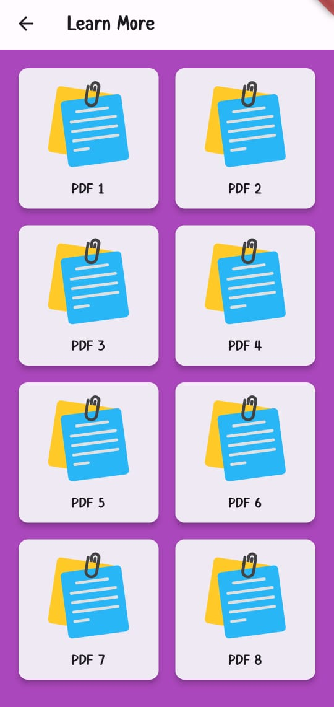   | 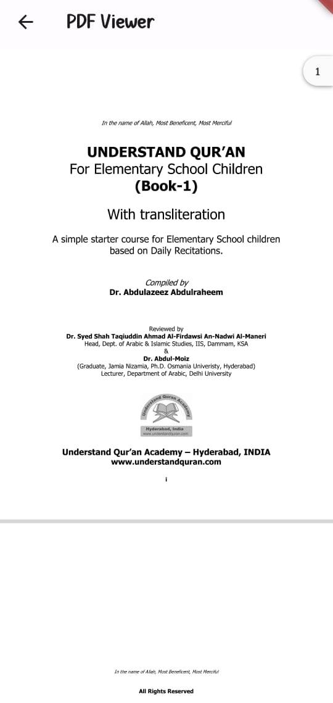 | 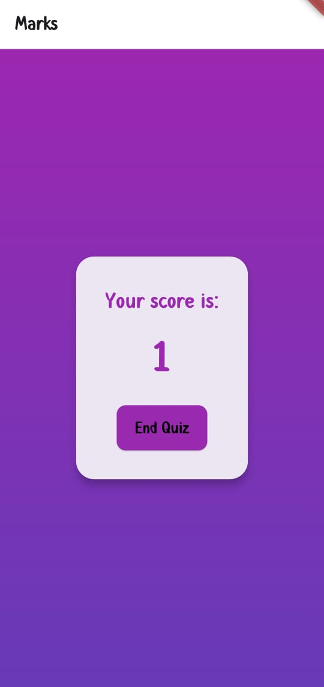  |

- The Learn More Screen provides additional information about the quiz content.
- Includes details such as quiz rules, instructions, or educational content.
- Enhances user experience with relevant resources and explanations.
------------------------------------------------------------------------------------------
- The Marks Screen shows the final score after completing the quiz.
- Users can view their score and navigate to other parts of the app.
- Provides a summary of performance and an option to restart the quiz.

------------------------------------------------------------------------------------------
------------------------------------------------------------------------------------------

------------------------------------------------------------------------------------------
------------------------------------------------------------------------------------------

### Database Design

| User Database                         | Question Database                         |
|---------------------------------------|-------------------------------------------|
| 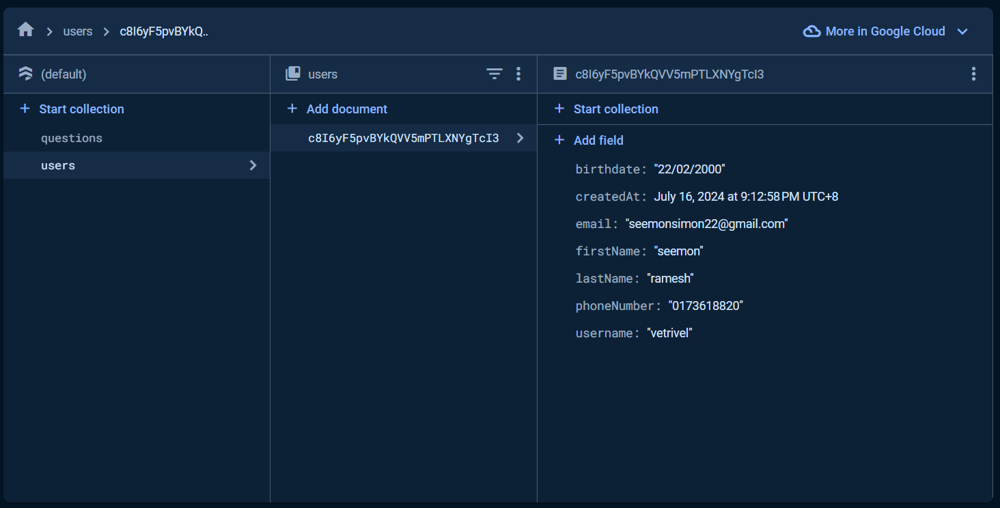 | 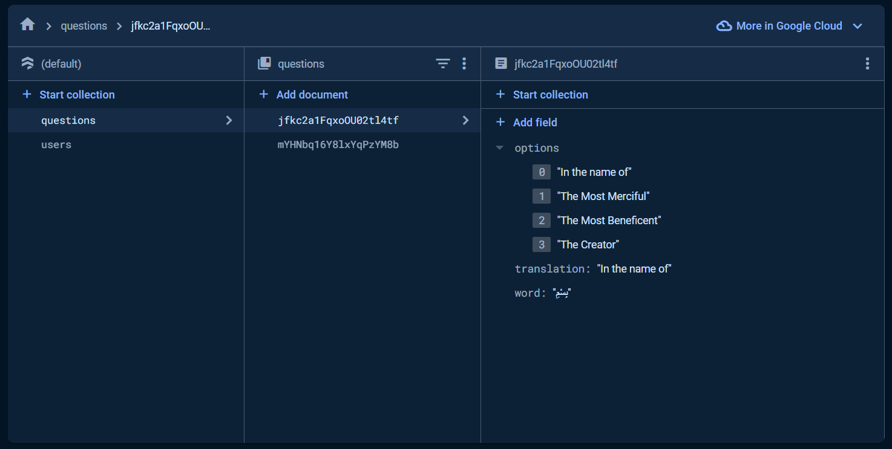 |

- A database user is an entity or account that has specific permissions to access and interact with a database management system (DBMS).
- Users are typically authenticated using credentials (like username and password) and are granted privileges to perform operations such as querying, inserting, updating, and deleting data within databases.
- Each database user can have distinct roles and permissions assigned, governing their access level and actions they can perform within the database environment.
------------------------------------------------------------------------------------------
- Options Array: Contains multiple strings representing different translations or meanings associated with a specific word or phrase from the Quranic verse.
- Translation: Provides the literal translation of the Quranic word or phrase in question, aiding users in understanding its meaning in a different language.
- Word: Represents the original Arabic text from the Quran, preserving its authenticity and providing a reference point for the translations offered.

------------------------------------------------------------------------------------------
------------------------------------------------------------------------------------------

## Getting Started

To run this Flutter project locally:

1. Clone the repository:
2. Update Pub get in pubspec.yaml
3. Flutter run to install in phone

